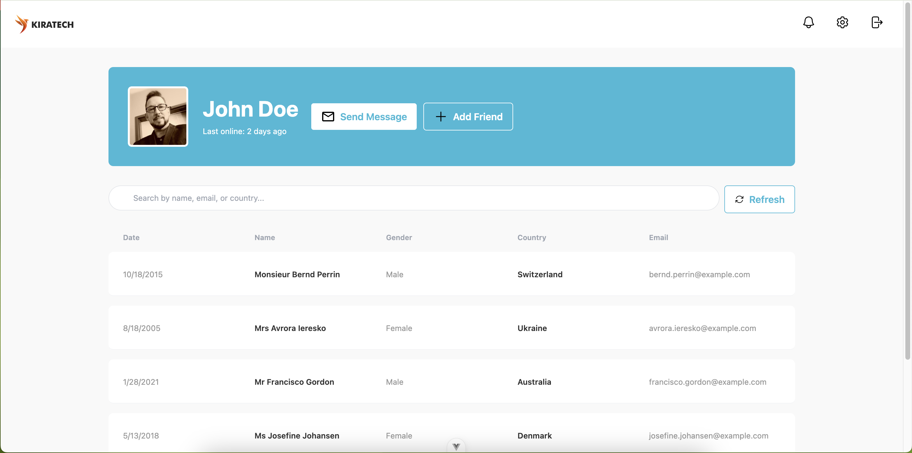
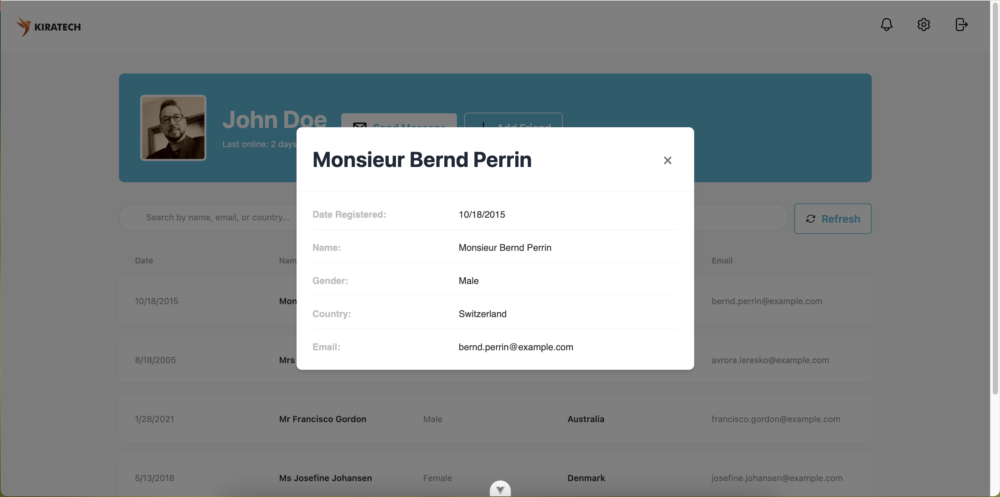

# Kiratech Tecnical assessment

## 🛠️ Installation

1. Clone the repository
```sh
git clone https://github.com/nabs32595/kiratech.git
cd kiratech
```

2. Install dependencies
```sh
pnpm install
```

3. Start the development server
```sh
pnpm dev
```

4. Visit `http://localhost:5173` in your browser

## 🧰 Tech Stack

- Vue 3
- Vite
- Tailwind CSS
- Vue Router
- Pinia for state management

## Live Demo

You can access the live demo of this project at [here](https://kiratech.netlify.app/).


## 📸 Screenshots

User list


User details modal


